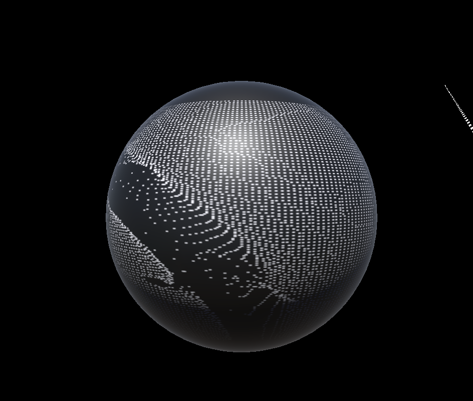

# jsar-gallery-canvas-particles-2d



A JSAR mini-app demostrates the 2D particles in canvas

## Open

Type the following URL in JSAR runtime:

```sh
https://raw.githubusercontent.com/M-CreativeLab/jsar-gallery-canvas-particles-2d/main/main.xsml
```

## License

Apache 2.0
